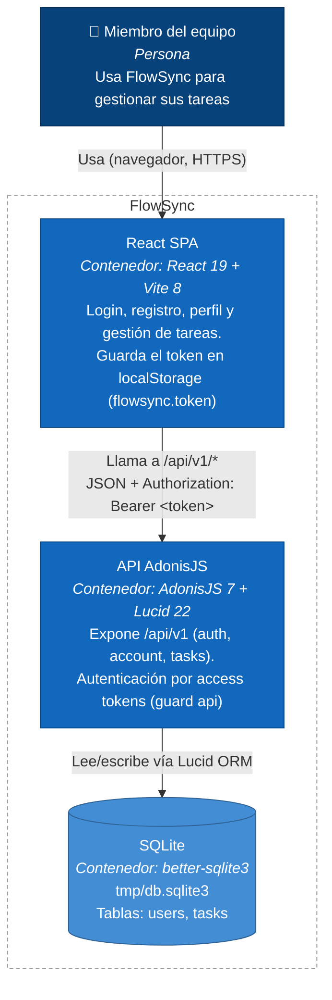

# Arquitectura — Diagrama de contenedores (C4)

Este diagrama muestra los contenedores que componen FlowSync y cómo se comunican, a partir de lo que existe hoy en el código: una SPA de React que consume una única API REST (AdonisJS), que a su vez persiste en SQLite a través de Lucid ORM. No se representan colas, cachés, servicios externos ni otros backends porque no hay nada de eso en el repo — `config/database.ts` solo define la conexión `sqlite`, y `frontend/src/lib/api.ts` es el único punto de contacto con el backend.

## Contenedores

- **React SPA** (`frontend/`) — puerto `5173` en desarrollo. Páginas de login, registro, perfil y tareas (`src/pages/`), con `lib/api.ts` como único cliente HTTP hacia el backend y `auth/auth-provider.tsx` gestionando el token de sesión.
- **API AdonisJS** (`backend/`) — puerto `3333`. Rutas bajo `/api/v1` (`start/routes.ts`): `auth/signup`, `auth/login`, `account/profile`, `account/logout` y el recurso `tasks` (listar, crear, ver detalle, cambiar estado, fijar fecha de vencimiento). Los controladores (`app/controllers/`) usan validadores VineJS, transformers (`app/transformers/`) para serializar la respuesta y los modelos Lucid `User` y `Task` (`app/models/`) para acceder a los datos.
- **SQLite** — fichero `tmp/db.sqlite3`, accedido mediante Lucid ORM (`config/database.ts`), con las tablas `users` y `tasks` (la relación `Task.assignee → User` está declarada en `app/models/task.ts`).
